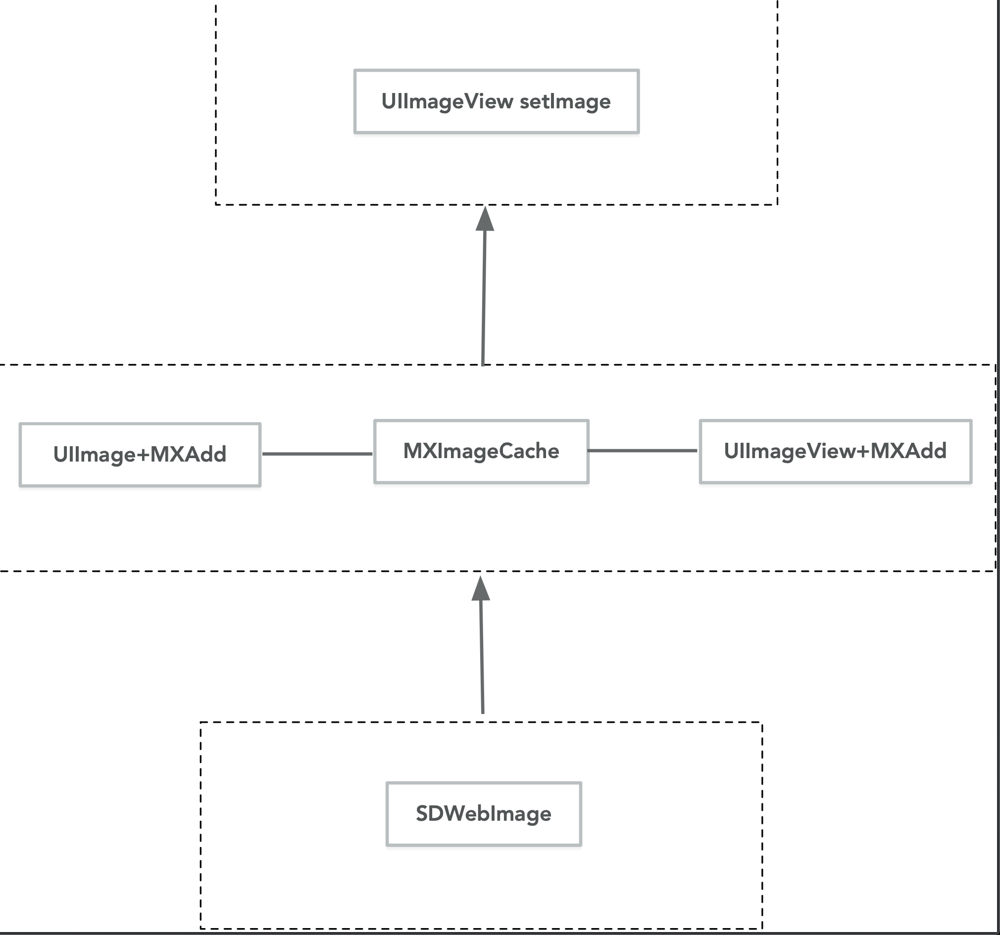

## MXImageManager
#### 简介
基于SDWebImage的图片管理
#### 安装使用
```Swift
pod 'MXImageManager'

AppDelegate.h
[MXImageCache mx_cancelSDMemoryCache];
```
#### 依赖库

```Swift
SDWegImage '5.0.6'
```
#### 文件结构

#### 说明

```Swift
见Demo
```
#### LICENSE
`MIT LICENSE`

